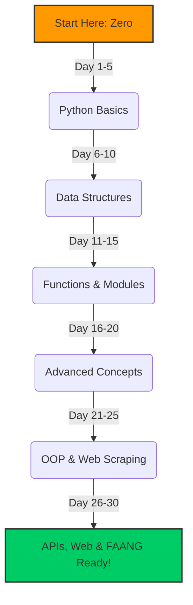

  <h1>🐍 Python From Zero to FAANG</h1>
  
<strong>A 30-Day Step-by-Step Challenge to Master Python (Beginner to FAANG Level)</strong>

  
  

    
    
    
  

---

## 🌟 Introduction
Welcome to **Python From Zero to FAANG**! This repository is heavily inspired by the incredible structure of the `30-Days-Of-Python` challenge, but supercharged with **premium, FAANG-level curriculum**, **baby-level explanations**, **visual memory tricks**, and **interview preparation**.

### 🔥 The Premium Structure
Every single day's folder is structured perfectly for maximum learning retention:
- `README.md` → **Learn:** Full notes, analogies, and FAANG tricks.
- `examples.py` → **Explore:** A coding playground with real examples.
- `exercises.md` → **Practice:** Challenge arena (Easy to Boss Fight).
- `solutions.py` → **Verify:** Answers to the challenges.
- `interview_questions.md` → **Prepare:** Ready for job interviews!

---

## 🗺️ Learning Roadmap

---

## 📅 The 30 Days Blueprint

- [x] **[Day 1 - Introduction and Variables](Day-01-Introduction-and-Variables/README.md)**
- [x] **[Day 2 - Data Types](Day-02-Data-Types/README.md)**
- [x] **[Day 3 - Conditionals](Day-03-Conditionals/README.md)**
- [x] **[Day 4 - Loops](Day-04-Loops/README.md)**
- [x] **[Day 5 - Functions](Day-05-Functions/README.md)**
- [x] **[Day 6 - Strings](Day-06-Strings/README.md)**
- [x] **[Day 7 - Lists](Day-07-Lists/README.md)**
- [x] **[Day 8 - Tuples](Day-08-Tuples/README.md)**
- [x] **[Day 9 - Sets](Day-09-Sets/README.md)**
- [x] **[Day 10 - Dictionaries](Day-10-Dictionaries/README.md)**
- [ ] **[Day 11 - Modules](Day-11-Modules/README.md)**
- [ ] **[Day 12 - List Comprehension](Day-12-List-Comprehension/README.md)**
- [ ] **[Day 13 - Higher Order Functions](Day-13-Higher-Order-Functions/README.md)**
- [ ] **[Day 14 - Type Errors](Day-14-Type-Errors/README.md)**
- [ ] **[Day 15 - Date Time](Day-15-Date-Time/README.md)**
- [ ] **[Day 16 - Exception Handling](Day-16-Exception-Handling/README.md)**
- [ ] **[Day 17 - Regular Expressions](Day-17-Regular-Expressions/README.md)**
- [ ] **[Day 18 - File Handling](Day-18-File-Handling/README.md)**
- [ ] **[Day 19 - Package Manager](Day-19-Package-Manager/README.md)**
- [ ] **[Day 20 - Classes and Objects](Day-20-Classes-and-Objects/README.md)**
- [ ] **[Day 21 - Web Scraping](Day-21-Web-Scraping/README.md)**
- [ ] **[Day 22 - Virtual Environment](Day-22-Virtual-Environment/README.md)**
- [ ] **[Day 23 - Statistics](Day-23-Statistics/README.md)**
- [ ] **[Day 24 - Pandas](Day-24-Pandas/README.md)**
- [ ] **[Day 25 - Python Web](Day-25-Python-Web/README.md)**
- [ ] **[Day 26 - Python with MongoDB](Day-26-Python-with-MongoDB/README.md)**
- [ ] **[Day 27 - API](Day-27-API/README.md)**
- [ ] **[Day 28 - Building API](Day-28-Building-API/README.md)**
- [ ] **[Day 29 - Data Science Basics](Day-29-Data-Science-Basics/README.md)**
- [ ] **[Day 30 - Conclusions](Day-30-Conclusions/README.md)**

---

### 🚀 How to Use This Repo
Click on any of the completed days above to jump straight into the premium notes and exercises for that topic. Make sure to commit every day to track your progress!

---

## 👨‍💻 Author & Contact
Created with passion by **Vamshi Batthula**.
Feel free to reach out if you have questions or want to collaborate!
📧 **Email:** [batthulavamshi740@gmail.com](mailto:batthulavamshi740@gmail.com)

## 📜 License
This project is licensed under the **MIT License**. See the [LICENSE](LICENSE) file for more details.
